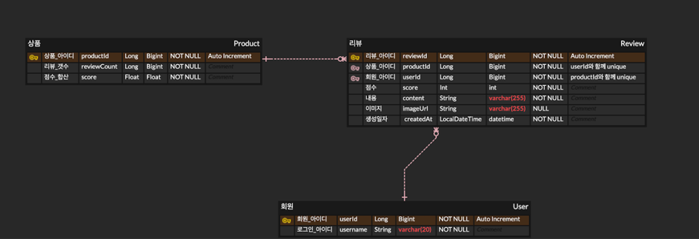

# 과제 설명
> 상품에 대한 review를 작성하고, 상품별 review 점수, 개수 및 리뷰 내용 관리

## 비즈니스 요구사항
- [x] 리뷰는 존재하는 상품에만 작성 가능
  - 존재하지 않으면 exception 발생
- [x] 유저는 하나의 상품에 대해 하나의 리뷰만 작성 가능
  - userId와 productId fk를 묶어서 복합 유니크 키로 설정
- [x] 유저는 1~5점 사이의 점수와 리뷰를 남길 수 있음
- [x] 사진은 선택적으로 업로드 가능
  - 더미구현체 생성
- [x] 리뷰는 '가장 최근에 작성된 리뷰' 순서대로 조회

## 기술적 요구 사항
- [x] Mysql 조회 시 인덱스를 잘 탈 수 있게 설계
  - Review 테이블에 대한 복합 인덱스 설정
- [x] 상품 테이블에 reviewCount 와 score 가 잘 반영되어야 함
  - 리뷰가 등록될 때마다 상품 테이블 업데이트
- [x] (Optional) 동시성을 고려한 설계
  - 비관적 락으로 동시성 고려
- [ ] (Optional) 테스트 코드를 작성

# 설계
## ERD 설계


## 인덱스 설정
```SQL
CREATE INDEX idx_review_product_id_created_at_review_id ON review (product_id, created_at, review_id);
```
- product_id로 필터링
- createdAt으로 정렬
- 커서로 사용하여 다음 페이지 시작점을 지정하는 데 review_id 사용